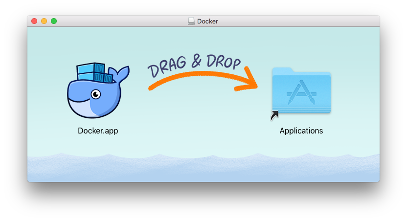
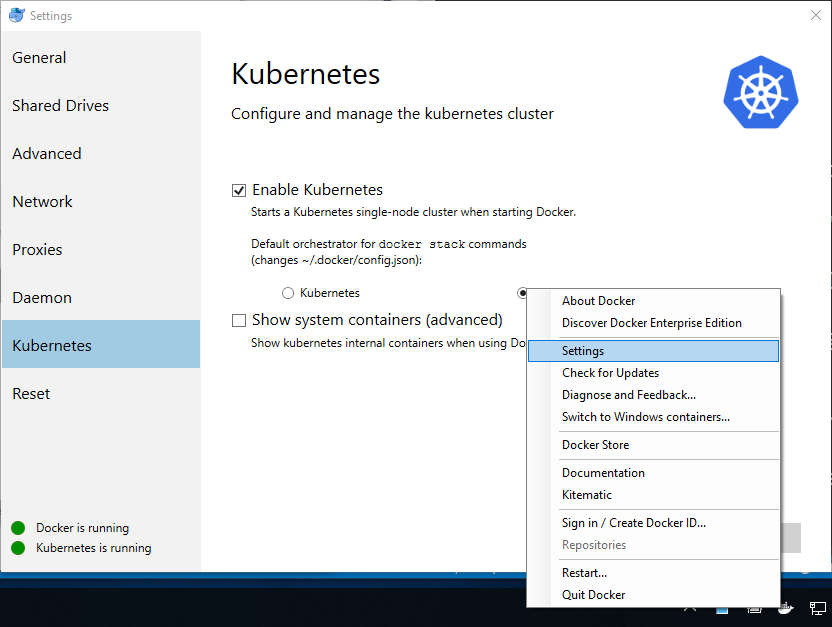

Installing Docker Community Edition
===================================

We're going to install Docker Community Edition, **Edge** channel, and flip it into Kubernetes mode.

Install Docker CE for your OS
-----------------------------

### Linux

Follow the instructions on docs.docker.com for your OS:

- Ubuntu: [https://docs.docker.com/engine/installation/linux/docker-ce/ubuntu/](https://docs.docker.com/engine/installation/linux/docker-ce/ubuntu/)
- Debian: [https://docs.docker.com/engine/installation/linux/docker-ce/debian/](https://docs.docker.com/engine/installation/linux/docker-ce/debian/)
- CentOS: [https://docs.docker.com/engine/installation/linux/docker-ce/centos/](https://docs.docker.com/engine/installation/linux/docker-ce/centos/)
- Fedora: [https://docs.docker.com/engine/installation/linux/docker-ce/fedora/](https://docs.docker.com/engine/installation/linux/docker-ce/fedora/)
- Other: [https://docs.docker.com/engine/installation/linux/docker-ce/binaries/](https://docs.docker.com/engine/installation/linux/docker-ce/binaries/)

### Mac

1. Visit [https://docs.docker.com/docker-for-mac/install/#what-to-know-before-you-install](https://docs.docker.com/docker-for-mac/install/#what-to-know-before-you-install) to ensure you have the requirements necessary.

2. Visit the [Docker Store](https://store.docker.com/) and create an account.

3. Download [Docker Community Edition](https://store.docker.com/search?offering=community&type=edition) **edge** channel and install as you would any Mac app.

   

### Windows

1. Turn on virtualization in the bios.  Every bios is different, so you'll need to search for the specifics.

2. Install `Hyper-V` from Start -> Control Panel -> Programs and Features -> Turn Windows Features on or off.

   

3. From the same dialog, also turn on Containers.

4. Visit the [Docker Store](https://store.docker.com/) and create an account.

5. Download [Docker Community Edition](https://store.docker.com/search?offering=community&type=edition) and install as you would any Windows app.

6. Gratuitous reboots.

### Docker in a VM

If you're installing Docker in a VMware Workstation VM, see [this post](https://communities.vmware.com/thread/498837) to get a VMware Workstation virtual machine to run Docker.  This assumes you've enabled virtualization on the host's bios so you can run VMware.

If you're installing Docker in a Windows VM running inside Parallels on your mac, see [this post](http://tattoocoder.com/configure-docker-for-windows-under-parallels/) to configure Parallels for nested virtualization.

If you're not in a VM, you can skip this section.

Verify it Works
---------------

From a command prompt / terminal, type:

`docker --version`

then type

`docker run hello-world`

If both of these work as expected, you've succeeded!

Enable Kubernetes
-----------------

1. In the Task tray (bottom-right on Windows, top-right on Mac), click on the whale icon, and choose settings.

2. Switch to the Kubernetes tab, enable Kubernetes, and click apply.

   

### **Don't have the Kubernetes tab?**

If you don't have the Kubernetes tab in your Docker settings, it means you're either running an older version of Docker or you're not on the Edge channel.  Try uninstalling Docker, downloading it again, and reinstalling.

Verify kubectl works
--------------------

kubectl is the command-line for Kubernetes, and was installed by Docker when you enabled Kubernetes mode.

From a command prompt / terminal, type:

`kubectl version`

If this returns a result for both client and server, you've succeeded!

Start downloading docker images
-------------------------------

Downloading docker images takes a while, so let's kick this off so we make sure they exist when we need them:

**Note**: Running on Windows?  Ensure you're in Linux mode.  Right-click on the docker system tray icon, and choose "Switch to Linux Containers".  If it says "Switch to Windows containers" you don't need to do anything, you're already there.

1. `docker pull node:alpine`
2. `docker pull microsoft/dotnet:2.1-aspnetcore-runtime-alpine`
3. `docker pull microsoft/dotnet:2.1-sdk-alpine`

Help your neighbor
------------------

There's someone sitting next to you who's struggling with this.  Let's pair and help each other.  When that machine is running, let's all celebrate and join another team.  At the end, we'll celebrate around the last machine.
